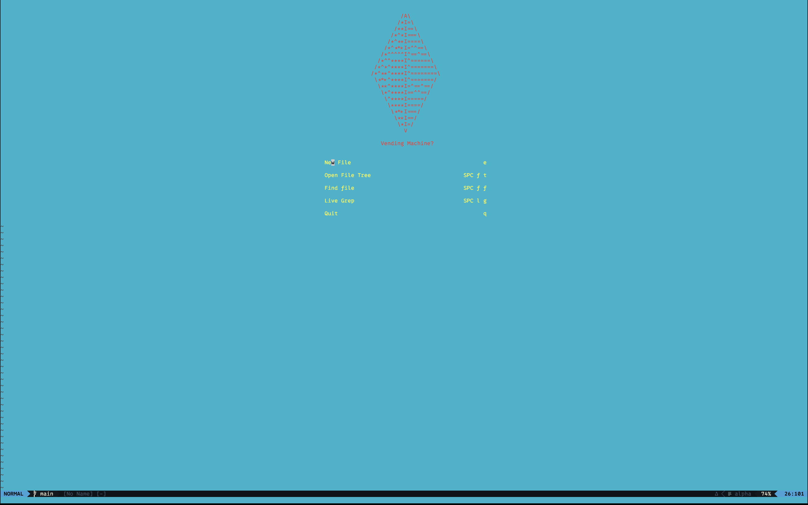

#Nvim Config

# Features
*   File Tree
*   Snippets
*   Autocomplete
*   Which Key
*   Split Windows

# KeyBinds
My config still has most default nvim keybinds. But for the non-default ones

```
<leader> = " "
<leader>ft : Opens file tree on the right side
<leader>ff : Find files in root directory
<leader>lg : Live grep
<leader>fc : Format code
<leader>ca : Code actions
<leader>h  : Hover
<leader>cd : Code definition
<leader>swh : Split current window horizontally
<leader>swv : Split current window vertically
<leader>c : Close current window
<leader>mr : Move cursor right
<leader>ml : Move cursor left
<leader>mu : Move cursor up
<leader>md : Move cursor down
```


# Install

## Dependencies

### Python

Make sure you have python 3 installed.

### Pynvim

```
pip install -U pynvim
```

### python-lsp-server

```
pip install 'python-lsp-server[all]' pylsp-mypy python-lsp-isort python-lsp-black
```

### Node

Install Node and make sure to export the path in either `.bash_profile` or `.zshrc`.

```
export PATH="path_to_node_bin_folder:$PATH"
```

After adding the path export source the file.

```
source ~/.bash_profile

or

source ~/.zshrc
```

### vim-language-server

After installing Node install the vim language server.

```
npm install -g vim-language-server
```

## Install Nvim

Make sure you install Nvim, and then copy this repo into the `~/.config/nvim/` folder (Or wherever your nvim install is located at).

